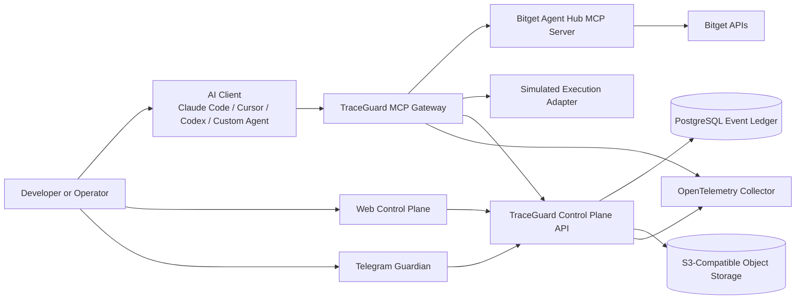
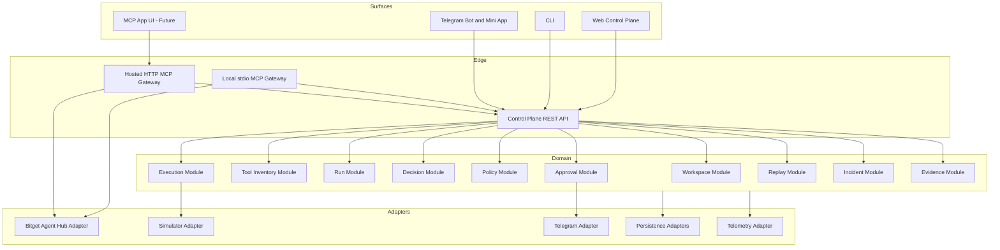
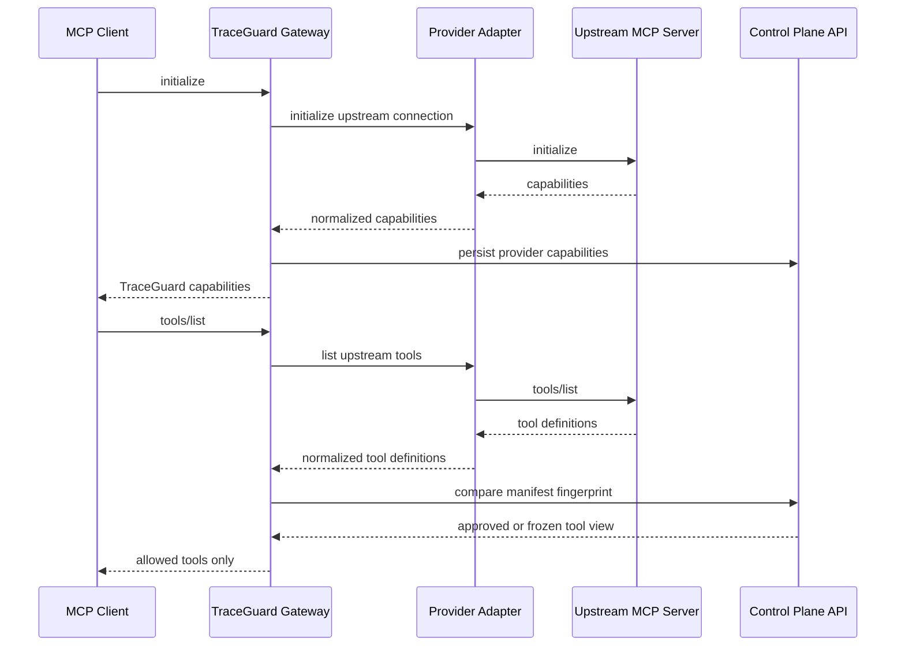
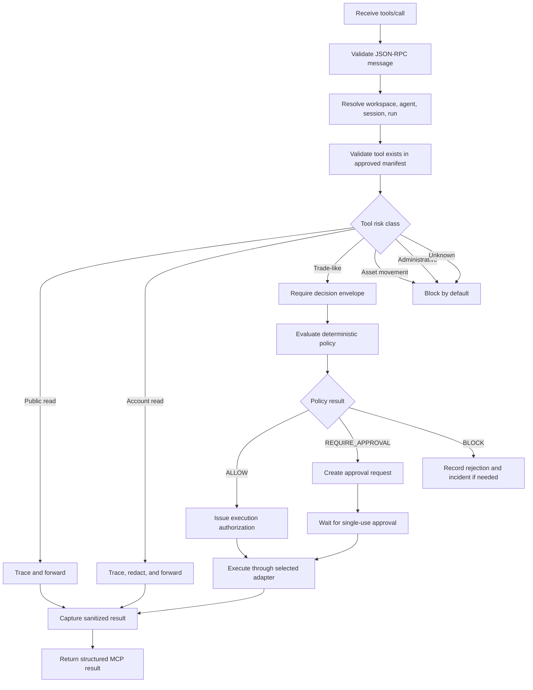

# TraceGuard Architecture Specification

**Document status:** Draft v0.1  
**Product:** TraceGuard  
**Category:** Trading Agent Safety Runtime  
**Initial provider:** Bitget Agent Hub  
**Long-term architecture:** Provider-neutral  
**Primary track:** Trading Infrastructure  
**Related documents:** `docs/product-spec.md`, `docs/user-flows.md`

---

## 0. Purpose

This document defines the production-grade architecture of TraceGuard.

It is derived from the user journeys in `docs/user-flows.md`, not from a desire to maximize the number of services or technologies in the system.

The central product promise is:

```text
Keep the existing trading agent workflow.
Insert TraceGuard between the agent and trading tools.
Gain governed tool access, approvals, replay, and auditable evidence.
```

The central architectural invariant is:

```text
Proposal ≠ Authorization ≠ Execution
```

An AI-generated action is evidence of intent. It is never authority by itself.

---

## 1. Executive Architecture Decision

TraceGuard should begin as a **modular monolith control plane with an independently deployable MCP Gateway**.

This is deliberately different from both extremes:

- not a throwaway fork of Bitget Agent Hub;
- not an early microservice maze.

### 1.1 Initial deployment units

```text
traceguard-control-plane
  Web UI
  REST API
  Policy management
  Approval orchestration
  Incident management
  Replay orchestration
  Audit export

traceguard-gateway-local
  stdio MCP gateway
  Local developer workflow
  Upstream stdio MCP process management
  Tool manifest import
  Tool-call tracing
  Policy pre-checks

traceguard-worker
  Replay execution
  Evidence bundle generation
  Notifications
  Outbox processing

traceguard-telegram-bot
  Telegram webhook handling
  Approval notifications
  Alert notifications
  Deep links
```

The code may live in one monorepo and share a single PostgreSQL database initially. The deployable processes are separated only where operational behavior genuinely differs.

### 1.2 Future deployment units

When usage justifies the additional complexity, TraceGuard may split out:

```text
traceguard-gateway-http
traceguard-policy-service
traceguard-replay-service
traceguard-execution-service
traceguard-notification-service
traceguard-evidence-service
```

The initial architecture must preserve these boundaries in code without forcing independent deployments prematurely.

---

## 2. Source Constraints and Compatibility Boundary

TraceGuard begins with Bitget Agent Hub but must not hard-code Bitget into its domain core.

Bitget Agent Hub currently exposes MCP Server and CLI integration modes. Its repository states that AI assistants can query prices and balances, place and cancel orders, manage futures positions, set leverage, and transfer funds. Public market data works without credentials, while private endpoints require API credentials.

The hackathon handbook is more conservative: it states that Agent Hub connection currently supports read access, synchronizes positions to a simulated account, and does not fully implement real-account order execution.

TraceGuard must therefore adopt the stricter interpretation:

```text
Public market data: supported first-class
Account reads: capability-detected and audited
Trade-like actions: simulated by default
Live execution: disabled unless explicitly detected, configured, policy-authorized, and documented
Asset movement: blocked by default
Administrative actions: blocked by default
```

The architecture must never assume that a provider supports a capability merely because the provider exposes a similarly named tool.

### 2.1 Capability detection

Every provider adapter must publish a versioned capability document:

```ts
interface ProviderCapabilities {
  provider: string;
  adapterVersion: string;
  detectedAt: string;

  marketData: {
    publicRead: boolean;
    accountRead: boolean;
  };

  execution: {
    simulated: boolean;
    liveOrderPlace: boolean;
    liveOrderCancel: boolean;
    leverageChange: boolean;
    internalTransfer: boolean;
    withdraw: boolean;
  };

  evidence: {
    toolManifest: boolean;
    structuredOutput: boolean;
    receiptLookup: boolean;
  };
}
```

Every capability is treated as `false` until detected or explicitly configured.

---

## 3. Architectural Goals

## 3.1 Goals

TraceGuard must:

1. preserve the user's existing agent workflow;
2. intercept MCP tool discovery and invocation;
3. classify exposed tools by risk;
4. detect unexpected tool-definition changes;
5. record a complete append-only run history;
6. require deterministic policy evaluation before sensitive actions;
7. separate an agent proposal from execution authorization;
8. support single-use, short-lived approvals;
9. support simulated execution as a first-class adapter;
10. support exact, policy, agent, and scenario replay;
11. generate exportable evidence bundles;
12. expose human-readable explanations before raw technical detail;
13. emit standard OpenTelemetry traces and metrics;
14. support local developer usage before requiring hosted infrastructure;
15. remain capable of adding providers other than Bitget later.

## 3.2 Non-goals

TraceGuard is not intended to:

- generate alpha;
- optimize trading strategies;
- predict prices;
- replace an exchange;
- become a full trading terminal;
- store exchange secrets in Telegram;
- expose model chain-of-thought;
- grant unrestricted live-execution permissions;
- treat an LLM-based checker as final authorization;
- create a blockchain dependency for its runtime core;
- require Kafka, Kubernetes, or multiple databases before usage demands them.

---

## 4. Design Principles

### 4.1 Domain boundaries before deployment boundaries

Modules should be separated in code based on business responsibility. They should become independent services only when scaling, reliability, security, or ownership needs justify that split.

### 4.2 Default deny

If TraceGuard cannot establish that an action is allowed, it must block or pause the action.

```text
Unknown → Deny
Stale data → Deny
Manifest changed → Freeze
Policy unavailable → Deny
Approval expired → Deny
Execution outcome unknown → Reconcile before retry
```

### 4.3 Evidence before convenience

Every sensitive action must generate enough structured evidence to answer:

```text
What was requested?
What context was used?
Which policy version evaluated it?
Which rules matched?
Who approved it?
What was sent upstream?
What result was returned?
Can the outcome be reconstructed?
```

### 4.4 Human language before infrastructure language

Technical fields exist, but the default operator experience uses trading language.

```text
Do not show by default:
Tool manifest hash mismatch

Show by default:
A trading tool changed unexpectedly. TraceGuard paused it until review.
```

### 4.5 Capability detection before feature claims

A provider adapter must expose what it actually supports. UI and marketing must not infer support from planned features.

---

## 5. System Context



### 5.1 Trust boundaries

```text
Boundary A: User device
Boundary B: TraceGuard local gateway
Boundary C: TraceGuard hosted control plane
Boundary D: Upstream MCP provider
Boundary E: Exchange API
Boundary F: Telegram platform
Boundary G: Object storage and telemetry backends
```

Every boundary crossing must be explicit in the threat model.

---

## 6. Deployment Modes

TraceGuard should support three modes.

## 6.1 Local Developer Mode

Use case:

```text
Solo developer
Safe Demo
Local agent experimentation
No live-capital dependency
```

Topology:

```text
AI Client
→ local stdio TraceGuard Gateway
→ local stdio Bitget MCP Server
→ Bitget public APIs

Local Gateway
→ hosted or local Control Plane API
```

Characteristics:

- easiest onboarding;
- stdio transport;
- local process supervision;
- public market-data support without exchange credentials;
- simulated execution by default;
- optional hosted dashboard;
- secrets remain local where possible.

## 6.2 Hybrid Personal Mode

Use case:

```text
Developer or advanced trader
Hosted Web Control Plane
Telegram approvals
Local gateway near secrets
```

Topology:

```text
AI Client
→ local stdio Gateway
→ upstream MCP provider

local Gateway
→ hosted Control Plane API over HTTPS
→ Telegram Guardian
```

Characteristics:

- exchange credentials remain on the user's device;
- hosted control plane stores sanitized evidence and metadata;
- approval decisions return short-lived authorization artifacts;
- raw provider payload storage is policy-controlled.

## 6.3 Hosted Team Mode

Use case:

```text
Small team or platform operator
Shared agents
Central approvals
Hosted gateway
```

Topology:

```text
AI Clients
→ hosted Streamable HTTP MCP Gateway
→ provider adapter
→ upstream MCP provider or direct provider API
```

Characteristics:

- workspace isolation;
- hosted secret manager;
- strong authentication;
- origin validation;
- session lifecycle management;
- rate limiting;
- centralized telemetry;
- durable replay workloads.

---

## 7. Modular Architecture



---

## 8. Domain Model

TraceGuard should use explicit aggregates and immutable versions.

## 8.1 Workspace

A protected operating environment.

```ts
type WorkspaceMode =
  | "safe_demo"
  | "approval_mode"
  | "guarded_autopilot"
  | "locked_investigation";

interface Workspace {
  id: string;
  name: string;
  mode: WorkspaceMode;
  activePolicyVersionId: string;
  createdAt: string;
  updatedAt: string;
}
```

Responsibilities:

- current operating mode;
- active policy version;
- membership;
- provider connections;
- Telegram bindings;
- risk defaults.

## 8.2 Provider Connection

A configured upstream integration.

```ts
interface ProviderConnection {
  id: string;
  workspaceId: string;
  providerType: "bitget_agent_hub" | "custom_mcp" | "generic_rest";
  transport: "stdio" | "streamable_http";
  status: "pending" | "connected" | "degraded" | "frozen" | "disabled";
  activeManifestVersionId?: string;
  credentialRef?: string;
  capabilities: ProviderCapabilities;
  createdAt: string;
  updatedAt: string;
}
```

## 8.3 Agent

A named identity that submits runs and decisions.

```ts
interface AgentIdentity {
  id: string;
  workspaceId: string;
  name: string;
  externalRef?: string;
  promptVersion?: string;
  modelProvider?: string;
  modelName?: string;
  status: "active" | "paused" | "disabled";
}
```

## 8.4 Tool Manifest

A reviewed snapshot of upstream MCP tool definitions.

```ts
interface ToolManifestVersion {
  id: string;
  providerConnectionId: string;
  providerVersion?: string;
  manifestHash: string;
  generatedAt: string;
  reviewStatus: "pending" | "approved" | "rejected" | "superseded";
  reviewedBy?: string;
  reviewedAt?: string;
}

interface ToolDefinitionRecord {
  id: string;
  manifestVersionId: string;
  name: string;
  title?: string;
  description?: string;
  inputSchema: unknown;
  outputSchema?: unknown;
  annotations?: unknown;
  schemaHash: string;
  riskClass:
    | "public_read"
    | "account_read"
    | "trade_like"
    | "asset_movement"
    | "administrative"
    | "unknown";
  status: "approved" | "frozen" | "blocked" | "needs_review";
}
```

## 8.5 Run

A complete protected agent interaction.

```ts
type RunStatus =
  | "created"
  | "capturing"
  | "decision_ready"
  | "policy_evaluating"
  | "allowed"
  | "approval_required"
  | "blocked"
  | "executing"
  | "completed"
  | "failed"
  | "replayed";

interface Run {
  id: string;
  workspaceId: string;
  agentId: string;
  providerConnectionId: string;
  mode: WorkspaceMode;
  status: RunStatus;
  traceId: string;
  startedAt: string;
  completedAt?: string;
}
```

## 8.6 Decision Envelope

The agent's public, structured proposal.

```ts
type DecisionAction =
  | "open_long"
  | "open_short"
  | "buy"
  | "sell"
  | "reduce"
  | "close"
  | "hold"
  | "abstain";

interface DecisionEnvelope {
  id: string;
  runId: string;
  instrument: string;
  marketType: "spot" | "futures" | "tokenized_stock";
  action: DecisionAction;
  thesis: string;
  confidence?: number;
  evidenceRefs: string[];
  requestedNotionalUsdt?: string;
  requestedQuantity?: string;
  requestedLeverage?: string;
  orderType?: string;
  limitPrice?: string;
  stopLoss?: string;
  takeProfit?: string;
  abstainReason?: string;
  promptVersion?: string;
  modelProvider?: string;
  modelName?: string;
  createdAt: string;
}
```

Rules:

- decision envelopes contain public reasoning summaries, not hidden chain-of-thought;
- execution cannot begin without a valid envelope for trade-like actions;
- financial and execution values (notional, quantity, leverage, limit price, stop loss, take profit) are represented as decimal strings at API boundaries;
- `confidence` is an advisory model score, not an execution parameter; it is represented as a number and is excluded from the decision hash and Action Digest;
- envelope schema is versioned.

## 8.7 Policy Version

```ts
interface PolicyVersion {
  id: string;
  workspaceId: string;
  policyId: string;
  version: number;
  sourceFormat: "yaml" | "json";
  sourceText: string;
  compiledAst: unknown;
  status: "draft" | "validated" | "published" | "superseded";
  createdBy: string;
  createdAt: string;
  publishedAt?: string;
}
```

## 8.8 Approval Request

```ts
type ApprovalStatus =
  | "pending"
  | "approved"
  | "rejected"
  | "expired"
  | "consumed"
  | "cancelled";

interface ApprovalRequest {
  id: string;
  workspaceId: string;
  runId: string;
  decisionId: string;
  actionDigest: string;
  status: ApprovalStatus;
  expiresAt: string;
  approvedBy?: string;
  approvedAt?: string;
  consumedAt?: string;
}
```

## 8.9 Execution Receipt

```ts
interface ExecutionReceipt {
  id: string;
  runId: string;
  decisionId: string;
  authorizationId: string;
  adapterType: "simulator" | "bitget_live" | "replay";
  idempotencyKey: string;
  actionDigest: string;
  status:
    | "simulated"
    | "submitted"
    | "filled"
    | "partially_filled"
    | "cancelled"
    | "rejected"
    | "failed"
    | "unknown";
  upstreamRef?: string;
  requestRef: string;
  responseRef?: string;
  createdAt: string;
  updatedAt: string;
}
```

## 8.10 Incident

```ts
interface Incident {
  id: string;
  workspaceId: string;
  runId?: string;
  providerConnectionId?: string;
  type:
    | "policy_violation"
    | "manifest_changed"
    | "stale_market_data"
    | "duplicate_execution"
    | "approval_failed"
    | "provider_degraded"
    | "credential_scope_mismatch"
    | "replay_mismatch";
  severity: "info" | "warning" | "high" | "critical";
  status: "open" | "investigating" | "mitigated" | "resolved" | "escalated";
  summary: string;
  createdAt: string;
  resolvedAt?: string;
}
```

---

## 9. Append-Only Event Ledger

The event ledger is the factual source of truth.

Projection tables exist for UI performance, but they must be reconstructible from immutable events.

## 9.1 Event envelope

```ts
interface LedgerEvent<TPayload = unknown> {
  id: string;
  workspaceId: string;
  aggregateType: string;
  aggregateId: string;
  eventType: string;
  eventVersion: number;
  occurredAt: string;
  actorType: "user" | "agent" | "system" | "provider";
  actorId?: string;
  runId?: string;
  traceId?: string;
  spanId?: string;
  correlationId?: string;
  causationId?: string;
  payload: TPayload;
  payloadHash: string;
  previousEventHash?: string;
  eventHash: string;
}
```

## 9.2 Required event types

```text
WorkspaceCreated
WorkspaceModeChanged
ProviderConnectionCreated
ProviderConnected
ProviderCapabilitiesDetected
ToolManifestImported
ToolManifestChanged
ToolManifestApproved
ToolFrozen
ToolBlocked
RunCreated
RunStarted
ToolCallRequested
ToolCallCompleted
ToolCallFailed
MarketSnapshotCaptured
DecisionProposed
DecisionValidated
PolicyEvaluationStarted
PolicyEvaluated
ApprovalRequested
ApprovalApproved
ApprovalRejected
ApprovalExpired
AuthorizationIssued
AuthorizationConsumed
AuthorizationExpired
AuthorizationRejected
ExecutionRequested
ExecutionCompleted
ExecutionRejected
ExecutionUnknown
RunCompleted
RunFailed
IncidentCreated
IncidentResolved
ReplayRequested
ReplayCompleted
ReplayMismatchDetected
EvidenceExportRequested
EvidenceExportGenerated
```

## 9.3 Hash chaining

Each event should include:

```text
payloadHash
previousEventHash
eventHash
```

This provides tamper evidence inside a run or aggregate stream.

A later proof layer may sign evidence bundles or anchor hashes externally, but the runtime core must not depend on blockchain availability.

---

## 10. MCP Gateway Architecture

The MCP Gateway is the most important integration boundary.

It protects users without forcing them to replace their existing AI client.

## 10.1 Supported transports

TraceGuard should support:

```text
Local Gateway:
stdio client-facing
→ stdio upstream

Hosted Gateway:
Streamable HTTP client-facing
→ stdio or Streamable HTTP upstream
```

The local gateway is the first implementation target.

## 10.2 MCP lifecycle



## 10.3 Tool listing rules

When the client requests `tools/list`, the gateway must:

1. fetch the upstream tool list;
2. normalize definitions deterministically;
3. compute a manifest fingerprint;
4. compare against the approved manifest version;
5. classify tools by risk;
6. freeze tools with unreviewed changes;
7. return only tools allowed for the current workspace and mode;
8. emit a `ToolManifestChanged` event if definitions changed;
9. create an incident when a sensitive tool changes.

## 10.4 Tool-call pipeline



## 10.5 Gateway responsibilities

The gateway must:

- speak MCP correctly;
- preserve JSON-RPC request IDs;
- separate logs from stdio protocol output;
- trace requests and responses;
- attach workspace and run context;
- normalize and fingerprint tool manifests;
- validate arguments against approved schemas;
- sanitize sensitive payloads;
- classify tools;
- enforce policy gates;
- pause for approval when required;
- avoid duplicate execution;
- emit OpenTelemetry spans;
- return clear structured errors.

The gateway must not:

- make discretionary risk decisions with an LLM;
- store raw secrets in traces;
- execute unknown tools;
- continue after manifest drift without review;
- infer live-execution support from naming alone.

## 10.6 Trace context

Every gateway operation should resolve:

```ts
interface TraceGuardContext {
  workspaceId: string;
  providerConnectionId: string;
  agentId: string;
  runId: string;
  traceId: string;
  spanId: string;
  mode: WorkspaceMode;
  policyVersionId: string;
  toolManifestHash: string;
  mcpSessionId?: string;
}
```

---

## 11. Provider Adapter Layer

Provider adapters prevent provider-specific logic from leaking into the domain core.

## 11.1 Interface

```ts
interface ProviderAdapter {
  readonly providerType: string;

  detectCapabilities(): Promise<ProviderCapabilities>;
  listTools(): Promise<NormalizedToolDefinition[]>;
  callTool(input: ProviderToolCall): Promise<ProviderToolResult>;

  getMarketSnapshot?(input: MarketSnapshotRequest): Promise<MarketSnapshot>;
  getAccountState?(input: AccountStateRequest): Promise<AccountState>;

  executeAuthorizedAction?(
    input: AuthorizedAction,
  ): Promise<ExecutionReceiptDraft>;
}
```

## 11.2 Initial adapters

```text
BitgetAgentHubAdapter
SimulatedExecutionAdapter
ReplayAdapter
```

## 11.3 Future adapters

```text
CustomMcpAdapter
GenericRestAdapter
AdditionalExchangeAdapter
BrokerAdapter
InternalTradingSystemAdapter
```

## 11.4 Bitget-first behavior

The Bitget adapter should:

- detect or launch `bitget-mcp-server` locally;
- fetch the tool list;
- classify Bitget market-data, account, order, transfer, withdraw, and administrative tools;
- support public market-data calls without private credentials;
- expose private capabilities only when credentials and scopes are present;
- default all write-like calls to simulation or deny;
- preserve upstream tool metadata in evidence bundles;
- emit Bitget-oriented onboarding diagnostics.

---

## 12. Policy Engine

Authorization must be deterministic.

Natural language may draft a policy, but only a reviewed, compiled, deterministic policy version may authorize execution.

## 12.1 Policy authoring pipeline

```text
Template or natural-language draft
→ structured draft
→ schema validation
→ compile typed AST
→ deterministic test suite
→ impact preview against historical runs
→ human publish
→ immutable version
→ activation
```

## 12.2 Policy DSL example

```yaml
policy_id: retail-safe
version: 3

mode:
  allowed:
    - safe_demo
    - approval_mode

instruments:
  allowed:
    - BTCUSDT
    - ETHUSDT

orders:
  max_order_notional_usdt: "1000"
  max_position_notional_usdt: "3000"
  max_leverage: "3"

approval:
  required_above_notional_usdt: "500"
  required_above_leverage: "2"

blocked_operations:
  - withdraw
  - internal_transfer
  - api_key_create

context:
  max_market_snapshot_age_seconds: 15
  require_decision_envelope: true
  require_approved_tool_manifest: true
```

## 12.3 Policy evaluation result

```ts
type PolicyOutcome = "allow" | "require_approval" | "block";

interface PolicyEvaluationResult {
  evaluationId: string;
  policyVersionId: string;
  outcome: PolicyOutcome;
  matchedRules: Array<{
    ruleId: string;
    outcome: PolicyOutcome;
    explanation: string;
    expected?: unknown;
    actual?: unknown;
  }>;
  evaluatedAt: string;
}
```

## 12.4 Core rules

Initial production rules should include:

```text
allowed instruments
allowed market types
maximum order notional
maximum position notional
maximum leverage
approval thresholds
blocked operation classes
market snapshot freshness
manifest review status
workspace mode
provider capability detection
required decision-envelope fields
```

## 12.5 Evaluation semantics

Rules should be composable but predictable.

Recommended precedence:

```text
Any BLOCK rule
→ BLOCK

Else any REQUIRE_APPROVAL rule
→ REQUIRE_APPROVAL

Else
→ ALLOW
```

---

## 13. Approval Service

Approvals must be narrow, short-lived, and auditable.

## 13.1 Approval artifact

An approval request binds to an immutable action digest.

```ts
interface ApprovalActionBinding {
  workspaceId: string;
  runId: string;
  decisionId: string;
  policyVersionId: string;
  toolManifestHash: string;
  actionPayloadHash: string;
  expiresAt: string;
}
```

The digest should include every material execution field.

```text
instrument
market type
action
notional
quantity
leverage
order type
limit price
stop loss
take profit
tool name
execution adapter
provider connection
policy version
tool manifest hash
mode
market snapshot reference
```

If any material field changes, approval is invalid.

## 13.2 Single-use authorization

TraceGuard issues a short-lived authorization record before any execution:

```ts
interface ExecutionAuthorization {
  id: string;
  approvalId?: string;
  actionDigest: string;
  status: "issued" | "consumed" | "expired" | "revoked";
  expiresAt: string;
  consumedAt?: string;
}
```

A `require_approval` outcome issues the authorization after human approval and sets `approvalId` to that approval. An `allow` outcome auto-issues the authorization directly from the policy result, leaving `approvalId` unset. Either path produces a single-use authorization, so no execution proceeds without one.

Execution adapters must reject reused authorizations.

## 13.3 Channels

```text
Web approval page
Telegram Guardian Bot
Telegram Mini App
MCP App approval card - future
```

All channels call the same Approval Service.

---

## 14. Execution Layer

Execution is an adapter concern and must never bypass policy.

## 14.1 Execution adapter interface

```ts
interface ExecutionAdapter {
  readonly adapterType: string;

  simulate(input: AuthorizedAction): Promise<ExecutionReceiptDraft>;

  executeLive?(
    input: AuthorizedAction,
  ): Promise<ExecutionReceiptDraft>;

  reconcile?(input: ReconcileRequest): Promise<ExecutionReceiptDraft>;
}
```

## 14.2 Simulator adapter

The simulator is a first-class production component, not a temporary mock.

It should support:

```text
open_long
open_short
buy
sell
reduce
close
hold
abstain
```

It should record:

```text
reference market snapshot
reference price
position before
position after
notional
leverage
fees model version
slippage model version
execution timestamp
receipt hash
```

## 14.3 Live adapter safeguards

A live adapter may execute only when:

```text
provider capability detected
workspace mode permits live execution
policy outcome allows execution
approval requirements satisfied
single-use authorization valid
manifest version approved
market snapshot fresh
idempotency key unused
credential scope sufficient
```

## 14.4 Idempotency

Every execution request must carry an idempotency key.

```text
execution:{workspaceId}:{runId}:{decisionId}:{actionDigest}
```

Retries must return the prior receipt or trigger reconciliation. They must not blindly create another order.

---

## 15. Replay Engine

Replay is a core runtime feature.

## 15.1 Replay bundle

```ts
interface ReplayBundle {
  bundleVersion: number;
  runId: string;
  workspaceId: string;
  providerConnectionId: string;
  agentId: string;
  mode: WorkspaceMode;
  toolManifestVersionId: string;
  policyVersionId: string;
  decisionEnvelope: DecisionEnvelope;
  marketSnapshotRefs: string[];
  toolCallRefs: string[];
  approvalRefs: string[];
  executionReceiptRefs: string[];
  eventRefs: string[];
  bundleHash: string;
}
```

## 15.2 Replay types

### Exact Replay

```text
same evidence bundle
same policy
same deterministic evaluator
same simulation model
→ reproduce original policy and simulated outcome
```

### Policy Replay

```text
same proposal
same market evidence
new policy version
→ compare authorization result
```

### Agent Replay

```text
same historical context
new prompt or model
→ compare proposed decision envelope
```

### Scenario Replay

```text
fixture set
multiple agents or policies
→ regression suite
```

## 15.3 Replay validity

Exact Replay must report:

```text
MATCH
EXPECTED_DIFFERENCE
UNEXPECTED_DIFFERENCE
INCOMPLETE_EVIDENCE
TAMPERED_BUNDLE
UNSUPPORTED_VERSION
```

A mismatch without an intentional version change should create an incident.

---

## 16. Evidence Bundles

Evidence export turns runtime history into a durable artifact.

## 16.1 Bundle contents

```text
run metadata
workspace mode
provider connection
agent identity
intent summary
tool manifest fingerprint
tool-call records
market snapshot references
decision envelope
policy source and compiled version
policy evaluation result
approval request and response
execution authorization
execution receipt or rejection record
replay results
bundle hash
```

## 16.2 Redaction profiles

```text
internal_full
developer_debug
public_demo
```

## 16.3 Integrity model

Each export should include:

```text
bundleHash
event hashes
object hashes
schema versions
generatedAt
generatedBy
```

Future extension:

```text
signed run receipt
signed approval receipt
optional external anchor
```

The initial runtime should not depend on an external chain.

---

## 17. Persistence Design

## 17.1 PostgreSQL

PostgreSQL is the system of record.

Use it for:

```text
workspaces
memberships
provider connections
provider capabilities
tool manifest versions
tool definitions
agents
runs
ledger events
policy versions
policy evaluations
approval requests
execution authorizations
execution receipts
incidents
replay jobs
replay results
evidence exports
telegram bindings
outbox messages
```

## 17.2 Object storage

Use S3-compatible object storage for:

```text
large market snapshots
large tool payloads
raw sanitized responses
replay bundles
evidence exports
PDF summaries
public demo exports
```

Objects should be content-addressed where practical.

```text
sha256/<hash>
```

## 17.3 Redis

Redis is optional initially.

Use it for:

```text
short-lived approval tokens
rate limits
session state
idempotency locks
short-lived cache
```

Redis must not be the only source of truth for approvals or execution receipts.

## 17.4 Transactional outbox

Do not introduce Kafka initially.

Use a PostgreSQL outbox table:

```text
domain transaction
→ write ledger event
→ write outbox message
→ worker publishes notification or task
→ mark outbox message delivered
```

This supports reliable Telegram notifications and evidence jobs without early distributed-system complexity.

---

## 18. Proposed Database Tables

```text
users
workspaces
workspace_members
agents
provider_connections
provider_capabilities
tool_manifest_versions
tool_definitions
runs
ledger_events
market_snapshots
decision_envelopes
policy_versions
policy_evaluations
approval_requests
execution_authorizations
execution_receipts
incidents
replay_jobs
replay_results
evidence_exports
telegram_bindings
outbox_messages
```

## 18.1 Key constraints

```text
ledger_events.event_hash UNIQUE
execution_receipts.idempotency_key UNIQUE
approval_requests.action_digest INDEX
execution_authorizations.action_digest INDEX
provider_connections(workspace_id, provider_type) INDEX
runs(workspace_id, started_at DESC) INDEX
tool_definitions(manifest_version_id, name) UNIQUE
policy_versions(policy_id, version) UNIQUE
```

## 18.2 Data retention

Retention must be configurable per workspace.

Suggested defaults:

```text
metadata: retain until user deletion policy applies
ledger events: long-term retention
raw sanitized payloads: 30 days by default
public demo evidence: user-selected
secrets: never stored in trace payloads
```

---

## 19. API Design

The REST API is the operator and orchestration interface.

The MCP Gateway remains the agent interface.

## 19.1 API conventions

```text
JSON over HTTPS
versioned routes: /api/v1
workspace-scoped resources
idempotency keys for write operations
cursor pagination
structured error codes
request IDs
trace IDs
```

## 19.2 Workspace API

```text
POST   /api/v1/workspaces
GET    /api/v1/workspaces/:workspaceId
PATCH  /api/v1/workspaces/:workspaceId/mode
```

## 19.3 Provider API

```text
POST   /api/v1/workspaces/:workspaceId/providers/bitget/connect
GET    /api/v1/providers/:providerId
GET    /api/v1/providers/:providerId/capabilities
GET    /api/v1/providers/:providerId/tools
POST   /api/v1/providers/:providerId/tools/refresh
GET    /api/v1/providers/:providerId/manifests/:manifestId/diff
POST   /api/v1/providers/:providerId/tools/:toolId/approve
POST   /api/v1/providers/:providerId/tools/:toolId/freeze
POST   /api/v1/providers/:providerId/tools/:toolId/block
```

## 19.4 Run API

```text
POST   /api/v1/workspaces/:workspaceId/runs
GET    /api/v1/workspaces/:workspaceId/runs
GET    /api/v1/runs/:runId
GET    /api/v1/runs/:runId/events
POST   /api/v1/runs/:runId/finish
```

## 19.5 Decision API

```text
POST   /api/v1/runs/:runId/decisions
GET    /api/v1/runs/:runId/decisions/:decisionId
```

## 19.6 Policy API

```text
GET    /api/v1/workspaces/:workspaceId/policies
POST   /api/v1/workspaces/:workspaceId/policy-drafts
POST   /api/v1/policy-drafts/:draftId/validate
POST   /api/v1/policy-drafts/:draftId/test
POST   /api/v1/policy-drafts/:draftId/publish
GET    /api/v1/policies/:policyId/versions
GET    /api/v1/policy-versions/:versionId/diff
```

## 19.7 Approval API

```text
GET    /api/v1/workspaces/:workspaceId/approvals
GET    /api/v1/approvals/:approvalId
POST   /api/v1/approvals/:approvalId/approve-once
POST   /api/v1/approvals/:approvalId/reject
```

## 19.8 Replay API

```text
POST   /api/v1/replays/exact
POST   /api/v1/replays/policy
POST   /api/v1/replays/agent
POST   /api/v1/replays/scenario
GET    /api/v1/replays/:replayId
GET    /api/v1/replays/:replayId/diff
```

## 19.9 Incident API

```text
GET    /api/v1/workspaces/:workspaceId/incidents
GET    /api/v1/incidents/:incidentId
POST   /api/v1/incidents/:incidentId/acknowledge
POST   /api/v1/incidents/:incidentId/resolve
```

## 19.10 Evidence API

```text
POST   /api/v1/runs/:runId/evidence-exports
GET    /api/v1/evidence-exports/:exportId
GET    /api/v1/evidence-exports/:exportId/download
```

## 19.11 Telegram API

```text
POST   /api/v1/telegram/bindings
POST   /api/v1/telegram/bindings/complete
DELETE /api/v1/telegram/bindings/:bindingId
POST   /api/v1/telegram/webhooks
```

---

## 20. OpenTelemetry Design

TraceGuard should use OpenTelemetry from the beginning.

The MCP semantic conventions are still under active development. TraceGuard should follow current MCP conventions where available and use the `traceguard.*` namespace for product-specific attributes.

## 20.1 Span hierarchy

```text
traceguard.run
├─ mcp.tools.list
├─ agent.perception
│  ├─ mcp.tools.call spot_get_ticker
│  ├─ mcp.tools.call futures_get_funding_rate
│  └─ mcp.tools.call futures_get_open_interest
├─ agent.decision
├─ traceguard.policy.evaluate
├─ traceguard.approval.wait
└─ traceguard.execution.simulate
```

## 20.2 Attributes

Use standard attributes where possible:

```text
mcp.method.name
gen_ai.operation.name
gen_ai.tool.name
jsonrpc.request.id
mcp.protocol.version
mcp.session.id
network.transport
server.address
error.type
```

Add TraceGuard-specific attributes:

```text
traceguard.workspace.id
traceguard.run.id
traceguard.agent.id
traceguard.provider.id
traceguard.mode
traceguard.policy.version
traceguard.policy.outcome
traceguard.instrument
traceguard.action
traceguard.tool.risk_class
traceguard.tool.manifest_hash
traceguard.execution.adapter
traceguard.execution.status
traceguard.replay.type
```

## 20.3 Sensitive-data rule

Do not emit:

```text
API keys
secret keys
passphrases
raw authorization tokens
unredacted account payloads
full prompt history by default
```

Detailed payload export should be opt-in and redacted.

---

## 21. Security Model

## 21.1 Threat categories

TraceGuard must address:

```text
unintended tool invocation
prompt injection in external content
tool poisoning
tool schema drift
tool shadowing
permission overreach
credential leakage
replay-bundle tampering
duplicate execution
stale market data
approval replay
approval expiry bypass
cross-workspace data access
notification spoofing
provider degradation
```

## 21.2 Default security posture

```text
Read-only tools:
allow with tracing and redaction

Trade-like tools:
require decision envelope and policy evaluation

Asset movement:
block by default

Administrative tools:
block by default

Unknown tools:
freeze pending review

Tool definition changes:
freeze changed tools

Live execution:
disabled until capability and workspace policy explicitly enable it
```

## 21.3 Prompt injection handling

All external natural-language content is untrusted:

```text
news
on-chain labels
tool descriptions
tool results
third-party resources
provider error messages
```

Controls:

```text
sanitize and label untrusted content
separate model proposal from deterministic authorization
require structured decision envelopes
validate every sensitive action against policy
never let an LLM bypass policy
record evidence references
```

## 21.4 Tool manifest review

Manifest fingerprint inputs should include:

```text
tool name
title
description
input schema
output schema
annotations
provider version
normalized ordering
```

Changed sensitive tools must be frozen before continued usage.

## 21.5 Secret management

Local mode:

```text
OS keychain or encrypted local secret store
process environment references
never commit .env secrets
```

Hosted mode:

```text
cloud secret manager or Vault
short-lived credential access where possible
credential references stored in database
```

Trace payloads store only:

```text
credential_ref
scope
provider
last_four if useful
```

## 21.6 Authentication and authorization

Hosted control plane should support:

```text
OIDC-compatible login
workspace roles
session expiry
CSRF protection
secure cookies
rate limiting
request audit
```

Initial roles:

```text
owner
operator
developer
viewer
```

Approval permission should be explicit, not implied by read access.

---

## 22. Failure Handling

TraceGuard is a safety boundary. Failure behavior matters more than happy-path polish.

## 22.1 Fail-closed matrix

| Failure | Runtime response | User-facing message |
|---|---|---|
| Policy engine unavailable | Block sensitive action | Safety checks are temporarily unavailable. No action was sent. |
| Approved manifest unavailable | Freeze tool | This tool is paused until its approved definition can be verified. |
| Market snapshot stale | Block trade-like action | Market data is stale. Refresh before submitting this action. |
| Approval expired | Reject execution | Approval expired. No action was sent. |
| Authorization reused | Reject execution and create incident | This approval was already used. No duplicate action was sent. |
| Upstream timeout before submission known | Retry only if safe | Provider did not respond. TraceGuard is verifying whether anything was submitted. |
| Upstream timeout after submission possible | Reconcile before retry | Order status is uncertain. TraceGuard paused retries until reconciliation. |
| Object storage unavailable | Continue only if minimum ledger evidence persists | Detailed evidence storage is degraded. Sensitive execution may be paused by policy. |
| Telegram delivery failure | Keep web approval pending | Telegram delivery failed. Review the pending action in the web control plane. |
| Database unavailable | Block sensitive execution | TraceGuard cannot store an auditable record. No action was sent. |

## 22.2 Unknown execution state

Never silently retry an order after an ambiguous timeout.

```text
Execution request sent
→ provider response missing
→ mark UNKNOWN
→ reconcile using upstream lookup if supported
→ otherwise require operator review
```

---

## 23. Repository Structure

```text
traceguard/
├─ apps/
│  ├─ control-plane-web/
│  ├─ control-plane-api/
│  ├─ gateway-local/
│  ├─ gateway-http/
│  ├─ worker/
│  ├─ telegram-bot/
│  └─ cli/
│
├─ packages/
│  ├─ domain/
│  │  ├─ workspaces/
│  │  ├─ providers/
│  │  ├─ tools/
│  │  ├─ runs/
│  │  ├─ decisions/
│  │  ├─ policies/
│  │  ├─ approvals/
│  │  ├─ executions/
│  │  ├─ replay/
│  │  ├─ incidents/
│  │  └─ evidence/
│  │
│  ├─ mcp-core/
│  ├─ mcp-gateway-runtime/
│  ├─ bitget-agent-hub-adapter/
│  ├─ simulator-adapter/
│  ├─ replay-adapter/
│  ├─ policy-engine/
│  ├─ event-ledger/
│  ├─ schemas/
│  ├─ db/
│  ├─ auth/
│  ├─ secrets/
│  ├─ telemetry/
│  ├─ testing-fixtures/
│  └─ ui/
│
├─ policies/
│  ├─ safe-demo.yaml
│  ├─ approval-mode.yaml
│  └─ guarded-autopilot.yaml
│
├─ docs/
│  ├─ product-spec.md
│  ├─ user-flows.md
│  ├─ architecture.md
│  ├─ threat-model.md
│  ├─ event-model.md
│  ├─ replay-contract.md
│  ├─ policy-semantics.md
│  ├─ api-contracts.md
│  ├─ adr/
│  └─ runbooks/
│
├─ infra/
│  ├─ docker/
│  ├─ migrations/
│  ├─ otel/
│  ├─ terraform/
│  └─ deployment/
│
└─ tests/
   ├─ unit/
   ├─ contract/
   ├─ integration/
   ├─ e2e/
   ├─ replay/
   ├─ security/
   └─ chaos/
```

---

## 24. Technology Choices

Recommended initial stack:

| Concern | Choice | Reason |
|---|---|---|
| Language | TypeScript | Aligns with MCP ecosystem and Bitget Agent Hub repository |
| Runtime | Node.js LTS | Strong stdio process integration and web support |
| Monorepo | pnpm workspace + Turborepo optional | Shared packages without premature deployment coupling |
| Web | Next.js or React Router-based React app | Operator control plane |
| API | Fastify | Typed, lightweight, production-ready Node server |
| Database | PostgreSQL | Durable append-only ledger and relational projections |
| ORM | Drizzle or Kysely | Typed SQL while preserving explicit database control |
| Validation | Zod + JSON Schema | API and MCP schema boundaries |
| Object storage | S3-compatible | Evidence and snapshot storage |
| Queue | PostgreSQL outbox first | Reliable jobs without early queue infrastructure |
| Cache | Redis optional | Short-lived tokens and locks only |
| Telemetry | OpenTelemetry | Standards-based tracing, logs, and metrics |
| Tests | Vitest + integration harness | Fast TS feedback loop |
| Local infra | Docker Compose | Reproducible contributor setup |

Avoid adopting a framework only because it appears fashionable. Every dependency must support a clear product requirement.

---

## 25. Testing Strategy

## 25.1 Unit tests

```text
policy precedence
policy compilation
policy explanation generation
action digest calculation
manifest normalization
manifest hashing
redaction
approval expiry
authorization consumption
idempotency
snapshot freshness
replay bundle verification
hash chaining
```

## 25.2 Contract tests

```text
MCP initialize
tools/list
tools/call
JSON-RPC error mapping
stdio log isolation
Streamable HTTP sessions
provider timeouts
provider schema changes
Bitget adapter normalization
Telegram webhook validation
```

## 25.3 Integration tests

```text
AI client fixture
→ local gateway
→ provider adapter
→ simulator
→ event ledger
→ approval
→ replay
→ evidence export
```

## 25.4 Security tests

```text
unknown tool blocked
tool description changed
tool input schema changed
tool output containing prompt injection
oversized order blocked
excessive leverage blocked
asset transfer blocked
withdraw blocked
stale snapshot blocked
expired approval blocked
reused approval blocked
duplicate idempotency key safe
cross-workspace access denied
secret redaction verified
```

## 25.5 Replay regression tests

Each release should run stable fixture bundles:

```text
same bundle
same evaluator
same policy
→ same result
```

## 25.6 Chaos tests

```text
upstream provider timeout
database failure
object storage failure
Telegram failure
worker crash
replayed outbox delivery
Redis loss
process restart during approval wait
process restart during ambiguous execution
```

---

## 26. Observability and Operations

## 26.1 Metrics

```text
traceguard_runs_total
traceguard_tool_calls_total
traceguard_tool_calls_blocked_total
traceguard_policy_evaluations_total
traceguard_policy_blocks_total
traceguard_approvals_pending
traceguard_approval_latency_seconds
traceguard_execution_unknown_total
traceguard_manifest_changes_total
traceguard_replay_mismatches_total
traceguard_outbox_backlog
```

## 26.2 Alerts

```text
policy engine unavailable
ledger persistence failure
execution state unknown
approval backlog high
tool manifest drift detected
replay mismatch detected
provider degraded
outbox backlog growing
```

## 26.3 Runbooks

Initial runbooks:

```text
tool-manifest-change.md
provider-degraded.md
unknown-execution-state.md
ledger-storage-failure.md
telegram-delivery-failure.md
replay-mismatch.md
credential-scope-mismatch.md
```

---

## 27. Implementation Sequence

The implementation order follows dependency structure, not demo theater.

## Phase 0: Product and threat model

Produce:

```text
docs/product-spec.md
docs/user-flows.md
docs/architecture.md
docs/threat-model.md
docs/event-model.md
docs/replay-contract.md
docs/policy-semantics.md
```

## Phase 1: Domain core

Implement:

```text
Decision Envelope schema
Policy DSL and AST
Deterministic policy evaluator
Action digest
Approval state machine
Execution authorization
Append-only ledger
Hash chaining
```

Exit criterion:

```text
A proposed simulated action can be allowed, escalated, or blocked deterministically and recorded as immutable events.
```

## Phase 2: Simulator and replay

Implement:

```text
market snapshot fixture
simulated positions
simulated execution receipts
exact replay
policy replay
bundle verification
```

Exit criterion:

```text
A stored run can be reconstructed and compared under another policy version.
```

## Phase 3: Local MCP Gateway

Implement:

```text
stdio gateway
upstream process management
MCP initialize
tools/list
tools/call
tool normalization
manifest fingerprint
risk classification
trace context
OpenTelemetry spans
```

Exit criterion:

```text
A real MCP client can discover Bitget tools through TraceGuard, call public market data, and persist a trace.
```

## Phase 4: Bitget-first onboarding

Implement:

```text
CLI init --provider bitget
Bitget Agent Hub detection
public market-data connection
capability detection
tool inventory import
Safe Demo policy template
guided BTCUSDT safety test
```

Exit criterion:

```text
A new developer can complete one protected Bitget-first run without editing source code.
```

## Phase 5: Web Control Plane

Implement:

```text
onboarding
dashboard
runs
run detail
policies
approvals
tool inventory
incidents
replay and diff
evidence export
```

## Phase 6: Telegram Guardian

Implement:

```text
binding
approval notifications
approve once
reject
blocked-action alerts
deep links
```

## Phase 7: Hosted Gateway

Implement:

```text
Streamable HTTP
workspace auth
origin validation
rate limiting
session lifecycle
secret manager integration
```

## Phase 8: Proof Trail

Implement only after runtime core is stable:

```text
signed receipts
signed evidence bundle
optional external anchor
artifact provenance
```

---

## 28. Hackathon Vertical Slice

The hackathon submission should expose a real slice of the production architecture.

Required story:

```text
Developer runs CLI onboarding
→ TraceGuard connects Bitget Agent Hub
→ Tool inventory imported and fingerprinted
→ Agent reads real Bitget market data through TraceGuard
→ Agent proposes a bounded simulated trade
→ TraceGuard evaluates policy
→ Telegram requests one-time approval
→ User approves
→ Simulator produces receipt
→ Agent later proposes oversized leveraged trade
→ TraceGuard blocks automatically
→ Operator opens Run Detail
→ Operator replays both runs
→ Operator compares diff
→ Operator exports public-demo evidence bundle
```

Required proof:

```text
real Bitget market-data call
imported Bitget tool inventory
tool manifest hash
structured decision envelope
policy evaluation record
Telegram approval
single-use authorization
simulated execution receipt
blocked-action record
replay result
diff result
evidence bundle
reproducible README
```

This is not a separate demo codebase. It is the first supported product journey.

---

## 29. Architecture Decision Records to Write Next

```text
ADR-001-modular-monolith-control-plane.md
ADR-002-independent-mcp-gateway.md
ADR-003-append-only-ledger.md
ADR-004-deterministic-policy-engine.md
ADR-005-simulator-first-execution.md
ADR-006-bitget-first-provider-neutral-core.md
ADR-007-postgresql-outbox-before-message-broker.md
ADR-008-opentelemetry-from-day-one.md
ADR-009-secrets-remain-local-in-hybrid-mode.md
ADR-010-telegram-as-companion-not-primary-control-plane.md
```

---

## 30. Open Architecture Questions

### MCP Gateway

- Should the first local gateway supervise the upstream `bitget-mcp-server` subprocess or connect to a separately configured process?
- How should long-running approvals map into MCP client expectations and timeout behavior?
- Which clients can resume a pending action cleanly?
- Should a sensitive action return a pending approval object immediately or use a task-like continuation model?

### Provider compatibility

- Which Bitget tools expose stable schemas suitable for initial fingerprinting?
- Which tools are public-read and credential-free in practice?
- Which private tools are available in the hackathon environment?
- How should capability differences be surfaced in onboarding?

### Evidence

- Which raw payloads should remain local in hybrid mode?
- Which snapshots are required for valid replay?
- Should evidence export default to JSON only, or JSON plus PDF summary?

### Policy

- Should the first implementation use a custom typed AST only, or support an external policy engine later?
- Which policy changes require stronger review?
- Should policy versions carry migration metadata?

### Approvals

- What is the default approval expiry?
- Which actions can never be approved through Telegram?
- Which roles may approve live execution?

### Hosted mode

- Which authentication provider should be used initially?
- Should hosted gateways support multi-region deployment?
- Which data must be tenant-encrypted separately?

---

## 31. Final Architecture Summary

```text
TraceGuard is a Bitget-first, provider-neutral safety runtime for trading agents.

It preserves existing agent workflows by inserting an MCP Gateway between the agent client and trading tools.

Its domain core separates proposal, authorization, and execution.

It records immutable run evidence, applies deterministic policies, requests narrow one-time approvals, supports simulation, and enables replay and diff.

The initial system is a modular monolith control plane with independently deployable local and hosted gateways.

The hackathon submission is the first complete vertical slice of the long-term product, not a throwaway demo.
```

---

## 32. Reference Notes

These sources informed protocol and integration decisions:

- Bitget Agent Hub repository: `https://github.com/Bitget-AI/agent_hub`
- MCP specification — transports: `https://modelcontextprotocol.io/specification/2025-06-18/basic/transports`
- MCP specification — tools: `https://modelcontextprotocol.io/specification/2025-06-18/server/tools`
- OpenTelemetry MCP semantic conventions: `https://opentelemetry.io/docs/specs/semconv/gen-ai/mcp/`
- MCP Apps announcement: `https://blog.modelcontextprotocol.io/posts/2026-01-26-mcp-apps/`

