# TraceGuard User Flows

**Document status:** Draft v0.1  
**Product:** TraceGuard  
**Scope:** Core user journeys, interaction boundaries, state transitions, and first-release interface contracts  
**Initial ecosystem:** Bitget Agent Hub  
**Primary surface:** Web Control Plane  
**Companion surface:** Telegram Guardian Bot + lightweight Mini App  
**Agent integration:** TraceGuard MCP Gateway  

---

## 0. Purpose

This document defines how real users interact with TraceGuard.

It deliberately starts from user behavior rather than implementation details.

The goal is to answer:

1. Who opens TraceGuard?
2. What problem are they trying to solve at that moment?
3. Which surface should they use: CLI, web, Telegram, or MCP?
4. What information should be visible by default?
5. Which actions require an explicit decision?
6. Which states must be represented in the product?
7. Which interfaces must exist for the product to support the flow reliably?

TraceGuard must feel like a safety layer added to an existing trading-agent workflow, not a replacement trading platform.

---

## 1. Product Interaction Model

TraceGuard uses one runtime with multiple entry points.

```text
Developer setup and acquisition
        ↓
GitHub README + CLI onboarding
        ↓
TraceGuard MCP Gateway
        ↓
Trading Agent Runtime
        ↓
Bitget Agent Hub Adapter

Operator configuration and investigation
        ↓
Web Control Plane

Time-sensitive approvals and alerts
        ↓
Telegram Guardian Bot + Mini App
```

### Surface ownership

| Surface | Primary user | Purpose | Should not be used for |
|---|---|---|---|
| CLI | Developer | Installation, local detection, initial configuration, diagnostics | Daily operations, complex investigation |
| MCP Gateway | Agent client | Tool discovery, policy checks, trace capture, upstream routing | Human-facing policy authoring |
| Web Control Plane | Developer, operator | Onboarding, runs, policy management, replay, diff, incidents, tool inventory | Urgent mobile approvals |
| Telegram Bot | Account owner, operator | Approval requests, block alerts, risk summaries, deep links | Complex policy editing, raw trace exploration |
| Telegram Mini App | Account owner, operator | Mobile review of approvals, recent blocks, current risk mode | Desktop-grade analysis |

---

## 2. Personas

## 2.1 Primary Persona: Solo Trading Agent Builder

### Profile

- building a trading agent using Bitget Agent Hub, MCP, CLI, or a custom agent loop;
- technically capable but time-constrained;
- wants to ship a useful agent without manually building a policy engine, approval workflow, trace viewer, and replay system;
- may be operating personal capital or a simulated account first;
- prefers fast setup and inspectable behavior.

### Existing workflow without TraceGuard

```text
Configure Bitget tools
→ expose them to an agent
→ test prompts manually
→ inspect terminal output
→ copy logs into notes
→ manually decide whether the behavior is safe
→ struggle to reproduce failures later
```

### Main frustration

> I can make my agent work, but I cannot confidently operate it over time.

---

## 2.2 Secondary Persona: Small-Team Agent Operator

### Profile

- operates one or more agents built by another developer;
- responsible for risk and approvals;
- does not want to inspect raw MCP payloads;
- wants a concise explanation and a reliable approval process;
- often uses mobile messaging for urgent actions.

### Existing workflow without TraceGuard

```text
Receive a message from a developer or bot
→ inspect a screenshot or chat explanation
→ approve informally
→ no durable record of exactly what was authorized
→ difficult incident review later
```

### Main frustration

> I need to know what the agent wants, why it wants it, and whether it fits the limits I already agreed to.

---

## 2.3 Tertiary Persona: Security-Conscious Platform Builder

### Profile

- building a product on top of multiple agent tools;
- needs policy versioning, tool-manifest review, audit export, and reproducible incident analysis;
- cares about future provider-neutral architecture.

### Existing workflow without TraceGuard

```text
Use generic logs and ad hoc wrappers
→ manually classify tool permissions
→ build one-off approval paths
→ no unified replay contract
→ no consistent evidence bundle
```

### Main frustration

> I need a reliable runtime boundary between AI-generated proposals and execution systems.

---

## 3. Design Principles for User Flows

1. **Keep existing agent workflows intact.**  
   The user should replace a direct tool connection with TraceGuard, not migrate all strategy logic into a proprietary framework.

2. **Show the simplest explanation first.**  
   Default views should use trading language. Technical fields remain expandable.

3. **Separate proposal, authorization, and execution.**  
   A model-generated action is never treated as permission by itself.

4. **Default to safe modes.**  
   New workspaces begin in Safe Demo mode.

5. **Use Telegram for urgency, not administration.**  
   Mobile surfaces handle approval and alerts. Web handles analysis and configuration.

6. **Avoid empty dashboards.**  
   Onboarding must generate a guided safety test and a first complete trace.

7. **Make every blocked action educational.**  
   The user should understand exactly which rule was triggered and how to change it safely.

8. **Never hide uncertainty.**  
   If upstream execution is unavailable, the UI must state that the order was simulated.

---

## 4. Global Object Model Visible to Users

These objects appear repeatedly across the user experience.

| Object | User-facing meaning |
|---|---|
| Workspace | A protected environment for one user or team |
| Provider | A connected tool ecosystem, initially Bitget Agent Hub |
| Agent | A configured trading-agent identity |
| Tool | A capability exposed to the agent, such as market data or order placement |
| Policy | A versioned set of rules describing what the agent may do |
| Run | One complete agent interaction from intent to final result |
| Decision | The structured action proposed by an agent |
| Approval | A human decision for a single sensitive action |
| Execution | A simulated or live adapter result |
| Replay | A reconstructed or re-evaluated historical run |
| Incident | A run or system event that requires investigation |
| Evidence Bundle | Exportable proof of what happened and under which policy |

---

## 5. Global Modes

TraceGuard must always display the active mode clearly.

| Mode | Description | Default execution behavior | Primary use |
|---|---|---|---|
| Safe Demo | No real capital risk | All trade-like actions simulated | First-time onboarding, demos, development |
| Approval Mode | Human confirmation before execution | Queries automatic; trade-like actions wait for approval | Personal usage, cautious operators |
| Guarded Autopilot | Bounded automation | Low-risk actions allowed; higher-risk actions escalated | Advanced usage |
| Locked Investigation | New execution paused | Existing evidence and replay remain available | Incident response |

### Mode transition rules

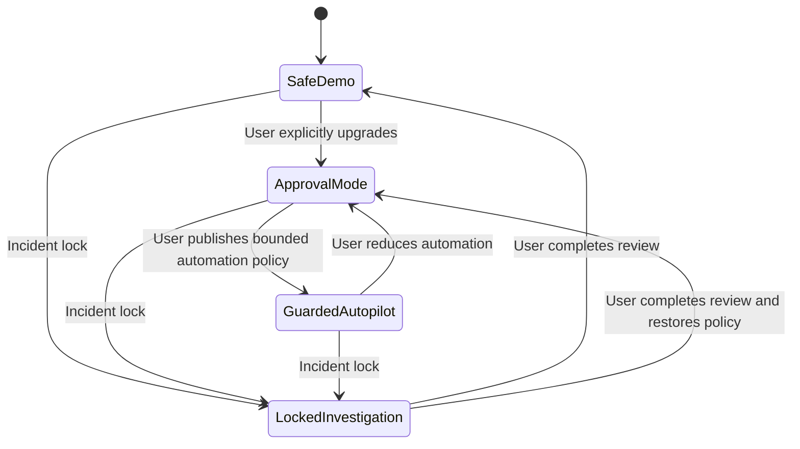

### UX requirement

The current mode must appear:

- in the web header;
- in the workspace dashboard;
- inside Telegram approval messages;
- inside replay results;
- inside evidence exports.

---

# 6. Flow A — First-Time Onboarding

## 6.1 User goal

> Connect my existing Bitget Agent Hub setup and see one protected run without reading a long manual.

## 6.2 Entry points

Primary entry:

```text
GitHub README
→ copy CLI command
```

Secondary entry:

```text
TraceGuard website
→ Create Workspace
→ copy CLI command
```

## 6.3 Happy path

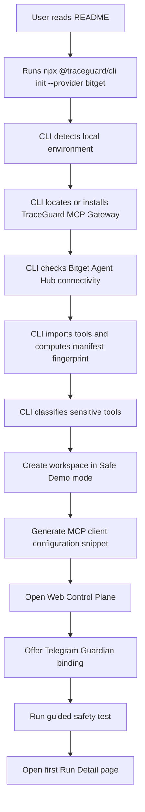

## 6.4 CLI interaction

Suggested command:

```bash
npx @traceguard/cli init --provider bitget
```

Suggested CLI output:

```text
TraceGuard setup

✓ Local environment detected
✓ TraceGuard MCP Gateway installed
✓ Bitget Agent Hub detected
✓ Tool inventory imported
✓ Sensitive tools classified
✓ Safe Demo mode enabled

Workspace: personal-bitget
Provider: Bitget Agent Hub
Imported tools: 58
Sensitive tools: 14 protected

Next steps:
1. Add the generated MCP configuration to your client.
2. Open the TraceGuard Control Plane.
3. Run the guided safety test.
```

## 6.5 Web onboarding screens

### Screen 1: Welcome

```text
Protect your trading agent in minutes.

TraceGuard adds policy checks, approvals, replay, and auditable traces between your agent and trading tools.

[Connect Bitget Agent Hub]
[Explore with Safe Demo]
```

### Screen 2: Provider connected

```text
Bitget Agent Hub connected

Imported tools: 58
Protected sensitive operations: 14
Tool manifest: Verified
Mode: Safe Demo

[Continue]
```

### Screen 3: Select safety template

```text
Choose how much control you want.

[Safe Demo]
All trade-like actions are simulated.

[Approval Mode]
Trading actions require your confirmation.

[Guarded Autopilot]
Small bounded actions may proceed automatically.
```

Initial release default:

```text
Safe Demo selected
```

### Screen 4: Minimal policy inputs

Ask only:

```text
Allowed instruments
Maximum order amount
Maximum leverage
```

Example:

```text
Allowed instruments: BTCUSDT, ETHUSDT
Maximum order amount: 1,000 USDT
Maximum leverage: 3×
```

### Screen 5: Optional Telegram connection

```text
Stay in control from your phone.

Connect Telegram Guardian to receive approval requests and risk alerts.

[Connect Telegram]
[Skip for now]
```

### Screen 6: Guided safety test

```text
Run your first protected scenario.

TraceGuard will:
1. read BTCUSDT market data;
2. create a simulated proposal;
3. apply your policy;
4. store a replayable trace.

[Run safety test]
```

### Screen 7: First value moment

Show a completed trace:

```text
Your first protected run is complete.

Market data: Captured
Decision: Simulated BTCUSDT buy
Policy: Passed
Execution: Simulated
Evidence: Stored

[Open Run Detail]
```

## 6.6 Error branches

### Bitget Agent Hub not detected

```text
Bitget Agent Hub was not detected.

You can:
[Install automatically]
[Show manual setup]
[Use Safe Demo without Bitget]
```

### Tool import failure

```text
TraceGuard could not import the current tool inventory.

No tools were exposed to the agent.

[Retry]
[Open diagnostics]
```

### Manifest fingerprint incomplete

```text
Some tool definitions could not be fingerprinted.

TraceGuard will keep these tools frozen until review.

[Review tools]
[Continue in Safe Demo]
```

## 6.7 Acceptance criteria

The onboarding flow is complete when:

- the workspace exists;
- Safe Demo is active;
- at least one provider is connected;
- tool inventory is imported or safely frozen;
- one guided run is stored;
- the user reaches a populated Run Detail page;
- Telegram binding is either completed or explicitly skipped.

---

# 7. Flow B — Telegram Binding

## 7.1 User goal

> Receive approvals and risk alerts on my phone without exposing account secrets in Telegram.

## 7.2 Security model

Telegram is a notification and approval surface.

It must never receive:

- exchange API keys;
- secret keys;
- full credential payloads;
- raw unredacted tool responses;
- unrestricted execution tokens.

Telegram receives:

- redacted action summary;
- one-time approval request identifier;
- short-lived signed deep link;
- minimal evidence summary;
- buttons for approve once, reject, or open full trace.

## 7.3 Binding flow

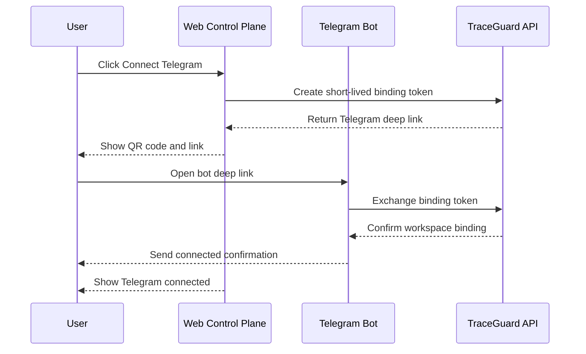

## 7.4 Bot confirmation message

```text
TraceGuard Guardian connected

Workspace: Personal Bitget
Mode: Safe Demo
Provider: Bitget Agent Hub

You will receive:
- approval requests;
- blocked-action alerts;
- tool-change alerts;
- incident summaries.

No exchange credentials are stored in Telegram.
```

## 7.5 Failure states

### Expired binding token

```text
This binding link has expired.
Return to TraceGuard and generate a new link.
```

### Already bound Telegram account

```text
This Telegram account is already connected to another TraceGuard user.

[Review existing binding]
[Cancel]
```

### Workspace access revoked

```text
Your access to this TraceGuard workspace has been revoked.
No further approvals can be issued from this Telegram account.
```

---

# 8. Flow C — Read-Only Agent Analysis

## 8.1 User goal

> Let my agent read market context without interrupting me for harmless requests.

## 8.2 Example user prompt

```text
Analyze BTC market conditions and tell me whether risk exposure should be reduced.
```

## 8.3 Expected runtime behavior

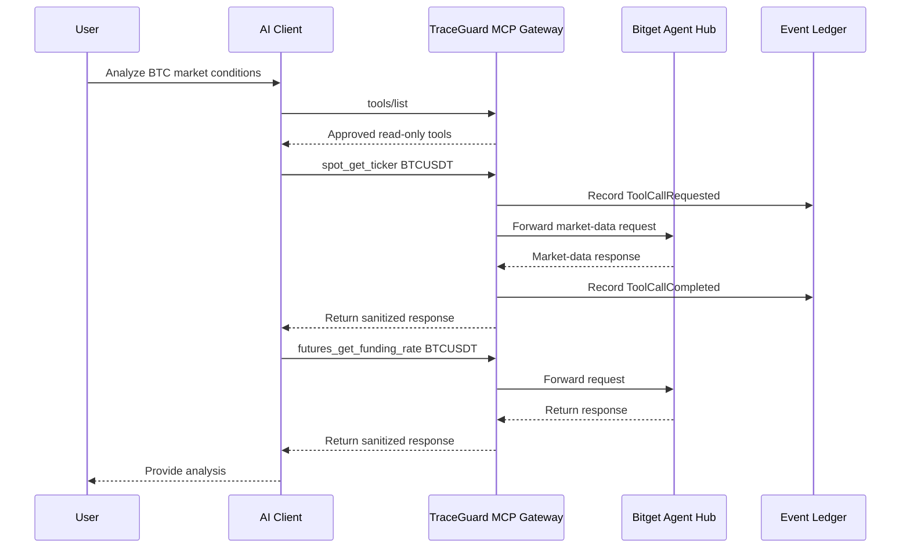

## 8.4 User experience

No Telegram message should be sent.

The web Runs page records:

```text
Run type: Analysis
Policy result: Allowed automatically
Execution: None
Mode: Safe Demo
```

## 8.5 Why this matters

TraceGuard must not become annoying.

Read-only analysis should remain lightweight and mostly invisible while still generating structured traces.

---

# 9. Flow D — Human-Approved Action

## 9.1 User goal

> Let the agent prepare a trade-like action, but require my explicit approval before execution.

## 9.2 Example agent proposal

```text
Buy 300 USDT of BTCUSDT at 2× leverage.
```

## 9.3 Preconditions

- workspace mode is Approval Mode;
- Telegram is connected or web approvals are available;
- proposal includes a valid Decision Envelope;
- market snapshot is fresh;
- policy version is active;
- execution adapter is available;
- sensitive tool manifest has not changed.

## 9.4 Decision Envelope summary

```json
{
  "instrument": "BTCUSDT",
  "action": "open_long",
  "requestedNotionalUsdt": "300",
  "requestedLeverage": "2",
  "thesis": "Momentum remains positive while funding is moderate.",
  "confidence": 0.72,
  "evidenceRefs": [
    "market_snapshot:btc_20260607_103000",
    "signal:funding_rate_001",
    "signal:open_interest_003"
  ]
}
```

## 9.5 Runtime sequence

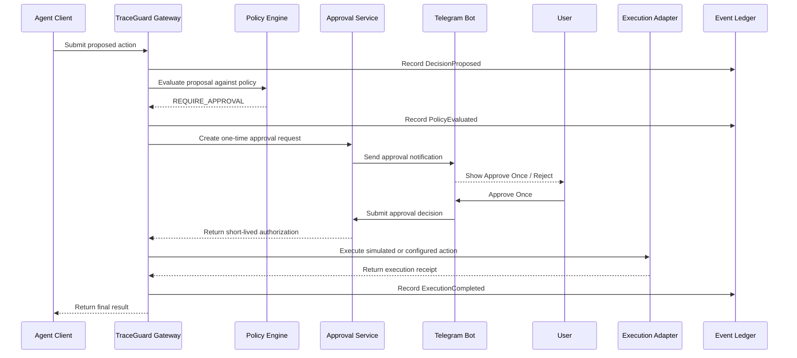

## 9.6 Telegram approval message

```text
BTCUSDT Buy Request

Agent: BTC Momentum Agent
Amount: 300 USDT
Leverage: 2×
Mode: Approval Mode

Why now:
Momentum remains positive while funding is moderate.

Policy checks:
✓ Asset allowed
✓ Amount within workspace limit
✓ Leverage within workspace limit

This approval applies only to this action and expires shortly.

[Approve Once] [Reject] [View Trace]
```

## 9.7 Approval state machine

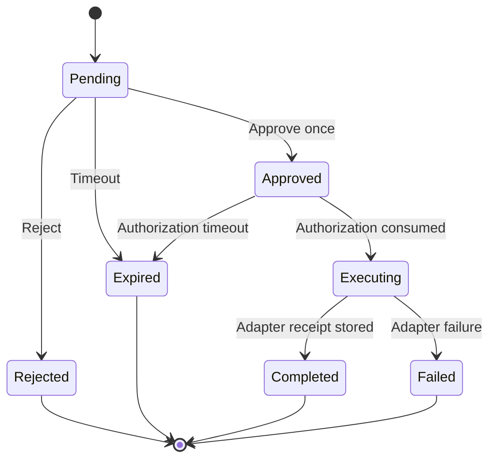

## 9.8 UX details

- `Approve Once` must create a single-use authorization bound to the exact action payload.
- If any material field changes after approval, a new approval is required.
- Approval must expire quickly.
- The UI must show whether execution is simulated or live.
- If the adapter is simulated, the button should say `Approve Simulated Action` where appropriate.

## 9.9 Failure states

### Approval expired

```text
Approval expired

No action was sent.
Request a new approval if this action is still needed.
```

### Proposal changed after approval

```text
Action changed after approval

TraceGuard detected a material difference in the proposed order.
A new approval is required.
```

### Telegram unavailable

```text
Telegram approval delivery failed.

The request remains pending in the Web Control Plane.
[Open Approvals]
```

---

# 10. Flow E — Dangerous Action Blocked Automatically

## 10.1 User goal

> Prevent an agent from exceeding explicit boundaries without requiring a human to notice in time.

## 10.2 Example proposal

```text
Buy 2,500 USDT of BTCUSDT at 8× leverage.
```

## 10.3 Policy

```text
Maximum order amount: 1,000 USDT
Maximum leverage: 3×
```

## 10.4 Runtime sequence

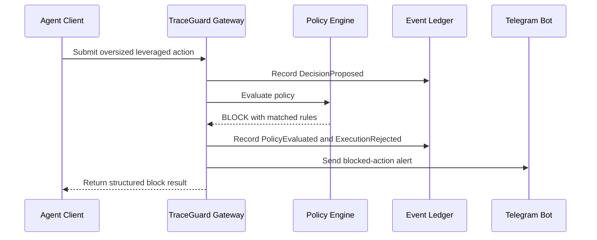

## 10.5 Telegram alert

```text
Action blocked by TraceGuard

Agent requested:
BTCUSDT Buy 2,500 USDT at 8× leverage

Why it was blocked:
- Maximum order size is 1,000 USDT
- Maximum leverage is 3×

No order was sent.

[View Trace] [Replay with Safe Policy]
```

## 10.6 Agent-facing structured response

```json
{
  "status": "BLOCKED",
  "reason_code": "POLICY_VIOLATION",
  "matched_rules": [
    {
      "rule": "max_order_notional_usdt",
      "allowed": 1000,
      "requested": 2500
    },
    {
      "rule": "max_leverage",
      "allowed": 3,
      "requested": 8
    }
  ],
  "execution_sent": false
}
```

## 10.7 UX requirement

The blocked state must answer four questions immediately:

```text
What did the agent request?
Which rule was violated?
Was anything executed?
What can I do next?
```

## 10.8 Recommended next actions

The UI may offer:

```text
[View Trace]
[Replay with Current Policy]
[Draft a safer action]
```

The UI must not offer a careless one-click permanent override.

---

# 11. Flow F — Tool Manifest Change Review

## 11.1 User goal

> Detect when an upstream trading tool changes unexpectedly before the agent continues using it.

## 11.2 Trigger

TraceGuard detects a difference in:

- tool name;
- description;
- input schema;
- output schema;
- permission classification;
- provider version;
- manifest fingerprint.

## 11.3 Runtime behavior

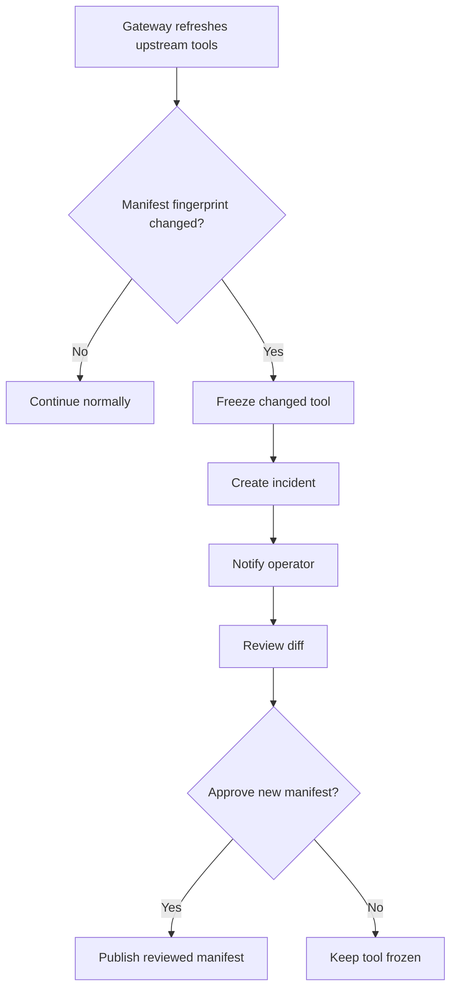

## 11.4 Telegram alert

```text
Trading tool paused for review

Provider: Bitget Agent Hub
Tool: futures_place_order
Reason: Tool definition changed unexpectedly
Status: Frozen

No agent can use this tool until review is complete.

[Review Change]
```

## 11.5 Web review page

Show:

```text
Previous manifest
vs.
Current manifest
```

Highlight:

- added parameters;
- removed parameters;
- changed descriptions;
- changed permission classification;
- changed schemas;
- provider version.

Actions:

```text
[Approve New Version]
[Keep Frozen]
[Block Tool]
```

---

# 12. Flow G — Incident Investigation

## 12.1 User goal

> Understand exactly what happened after an unexpected agent action or system warning.

## 12.2 Entry points

- Telegram incident alert;
- Dashboard incident card;
- Runs filter: `Blocked`, `Failed`, `Changed Tool`, or `Approval Failed`;
- direct deep link from an audit export.

## 12.3 Investigation journey

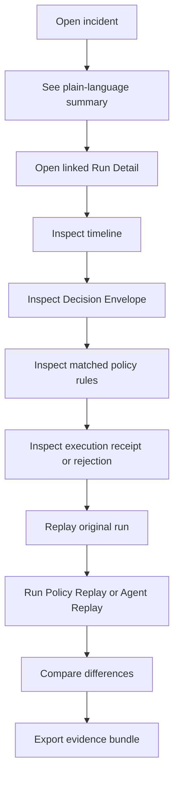

## 12.4 Incident summary card

```text
Incident: Oversized leveraged action blocked

Agent: BTC Momentum Agent
Time: 2026-06-07 10:32 UTC
Instrument: BTCUSDT
Requested action: Buy 2,500 USDT at 8× leverage
Result: Blocked before execution

Why:
- Maximum order amount exceeded
- Maximum leverage exceeded

[Open Run Detail]
[Replay]
[Export Evidence]
```

## 12.5 Run Detail timeline

```text
Intent
  User asked the agent to increase BTC exposure.

Perception
  BTCUSDT ticker captured
  Funding rate captured
  Open interest captured

Decision
  open_long BTCUSDT
  Requested notional: 2,500 USDT
  Requested leverage: 8×
  Confidence: 0.78

Risk evaluation
  BLOCKED
  max_order_notional_usdt violated
  max_leverage violated

Execution
  No order was sent.

Evidence
  Decision envelope stored
  Market snapshot stored
  Policy version stored
  Tool manifest stored
```

---

# 13. Flow H — Replay and Diff

Replay is a central product feature, not a secondary analytics tab.

## 13.1 User goals

- reproduce an original result;
- test a stricter or looser policy;
- compare prompt versions;
- compare model versions;
- confirm whether an incident remains possible after a fix.

## 13.2 Replay types

| Replay type | Inputs preserved | Inputs changed | Purpose |
|---|---|---|---|
| Exact Replay | Snapshot, decision, policy, adapter result | None | Reconstruct the original outcome |
| Policy Replay | Snapshot, decision | Policy version | Verify policy changes |
| Agent Replay | Snapshot, tools | Prompt or model | Detect behavioral drift |
| Scenario Replay | Fixture bundle | Scenario parameters | Regression testing |

## 13.3 Exact Replay flow

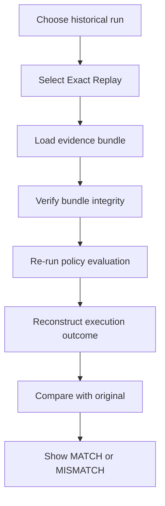

## 13.4 Policy Replay flow

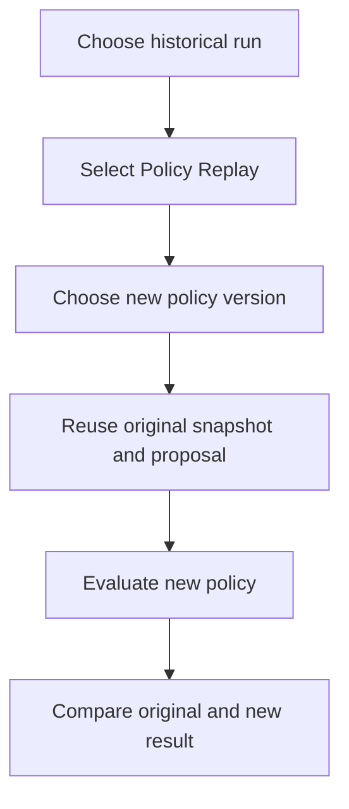

## 13.5 Diff page

Default columns:

| Field | Original Run | Replay Run |
|---|---|---|
| Mode | Approval Mode | Approval Mode |
| Market snapshot | Same | Same |
| Decision | open_long | open_long |
| Requested notional | 2,500 USDT | 2,500 USDT |
| Requested leverage | 8× | 8× |
| Policy version | policy-v1 | policy-v2-strict |
| Result | Approval Required | Blocked |
| Execution | None | None |

Highlight only changed fields by default.

Expanded view:

```text
Tool outputs
Decision envelope
Policy source
Matched rules
Approval record
Execution receipt
Manifest fingerprint
Evidence hash
```

## 13.6 Replay success states

```text
MATCH
Original outcome reproduced successfully.
```

```text
EXPECTED DIFFERENCE
The new policy blocks an action previously requiring approval.
```

```text
UNEXPECTED DIFFERENCE
Replay result changed without an intentional version change.
Review the linked evidence.
```

---

# 14. Flow I — Policy Authoring

## 14.1 User goal

> Define clear agent boundaries without writing complex security code.

## 14.2 Entry points

- onboarding template selection;
- Policies page;
- incident remediation action;
- natural-language policy draft.

## 14.3 Basic policy page

Show simple controls:

```text
Allowed instruments
Maximum order amount
Maximum position amount
Maximum leverage
Approval threshold
Blocked operations
Active mode
```

## 14.4 Natural-language draft flow

User enters:

```text
Only allow BTC and ETH.
Do not allow orders above 500 USDT.
Ask me before using leverage above 2×.
Never allow withdrawals or transfers.
```

TraceGuard returns a draft:

```yaml
allowed_instruments:
  - BTCUSDT
  - ETHUSDT
max_order_notional_usdt: 500
manual_approval_above_leverage: 2
blocked_operations:
  - withdraw
  - transfer
```

The product then requires:

```text
Review
→ Run policy tests
→ Publish version
```

## 14.5 Publish flow

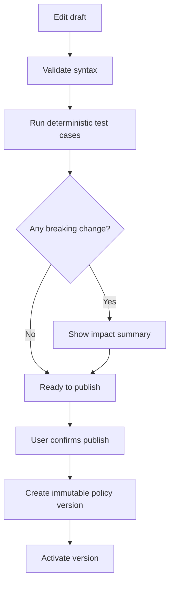

## 14.6 Policy version card

```text
policy-v3
Published by AlexSam
Active since 2026-06-07 14:20 UTC

Changes:
- Max leverage reduced from 5× to 3×
- Added approval requirement above 700 USDT
- Blocked internal transfers

Impact preview:
12 historical runs would change result

[Open Diff]
[Run Replay Suite]
```

---

# 15. Flow J — Audit Export

## 15.1 User goal

> Export a durable record of what happened for review, debugging, or external sharing.

## 15.2 Evidence bundle contents

```text
run metadata
intent summary
decision envelope
market snapshot references
tool-call records
tool-manifest fingerprint
policy version
policy evaluation result
approval record
execution receipt or rejection record
replay results
bundle hash
```

## 15.3 Export flow

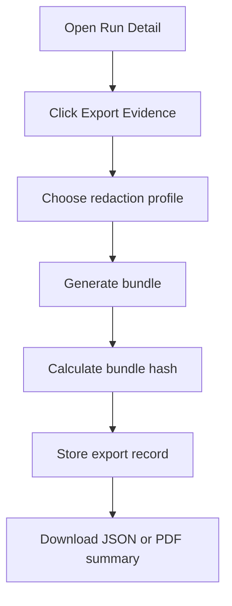

## 15.4 Redaction profiles

| Profile | Use |
|---|---|
| Internal Full | Team investigation |
| Developer Debug | Share with maintainers while hiding secrets |
| Public Demo | Hackathon, documentation, issue reports |

---

# 16. Web Information Architecture

```text
Dashboard
Runs
  └─ Run Detail
Replay
  └─ Diff
Policies
  └─ Policy Detail
  └─ Policy Tests
Approvals
Tool Inventory
Incidents
Audit Exports
Settings
  ├─ Workspace
  ├─ Providers
  ├─ Agents
  ├─ Telegram
  └─ Secrets
```

## 16.1 Dashboard

Question answered:

> Is everything safe right now?

Show:

- current mode;
- connected providers;
- active agents;
- pending approvals;
- blocked actions today;
- tool changes requiring review;
- recent runs;
- recent incidents.

Avoid generic price charts unless they directly support a run or incident.

## 16.2 Runs

Question answered:

> What have my agents been doing?

Columns:

```text
Run ID
Agent
Provider
Instrument
Mode
Decision
Policy Result
Execution Result
Time
```

Filters:

```text
Allowed
Blocked
Approval Required
Failed
Replayed
Analysis Only
```

## 16.3 Run Detail

Question answered:

> Why did this happen?

Timeline:

```text
Intent
→ Perception
→ Tool Calls
→ Decision
→ Policy
→ Approval
→ Execution
→ Evidence
```

## 16.4 Replay

Question answered:

> What would change under another policy, prompt, or model?

## 16.5 Tool Inventory

Question answered:

> Which capabilities are exposed to the agent?

## 16.6 Incidents

Question answered:

> What requires investigation now?

---

# 17. Telegram Information Architecture

## Bot commands

```text
/start
/status
/approvals
/blocks
/incidents
/mode
/help
```

## Mini App tabs

```text
Approvals
Recent Blocks
Agents
Risk Mode
```

## Deep links

Telegram alerts should deep-link into:

- specific approval;
- specific run;
- specific incident;
- specific tool-manifest change.

---

# 18. Notification Rules

TraceGuard should avoid alert fatigue.

| Event | Telegram | Web notification | Email |
|---|---|---|---|
| Read-only analysis completed | No | Optional | No |
| Approval required | Yes | Yes | Optional |
| Dangerous action blocked | Yes | Yes | Optional |
| Tool manifest changed | Yes | Yes | Optional |
| Execution adapter failed | Yes | Yes | Optional |
| Replay completed | No | Yes | No |
| Daily risk summary | Optional | Yes | Optional |
| Policy published | Optional | Yes | Optional |

---

# 19. State Model

## 19.1 Run states

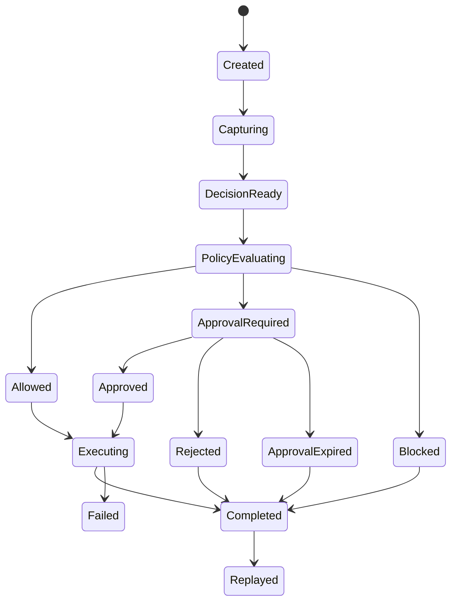

## 19.2 Tool states

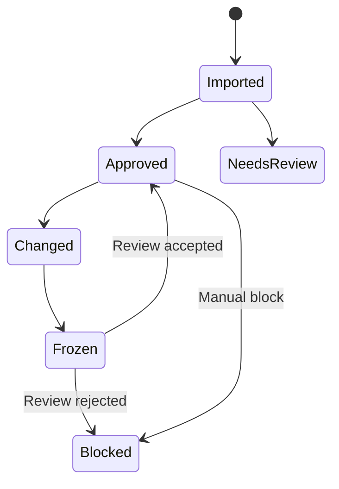

## 19.3 Incident states

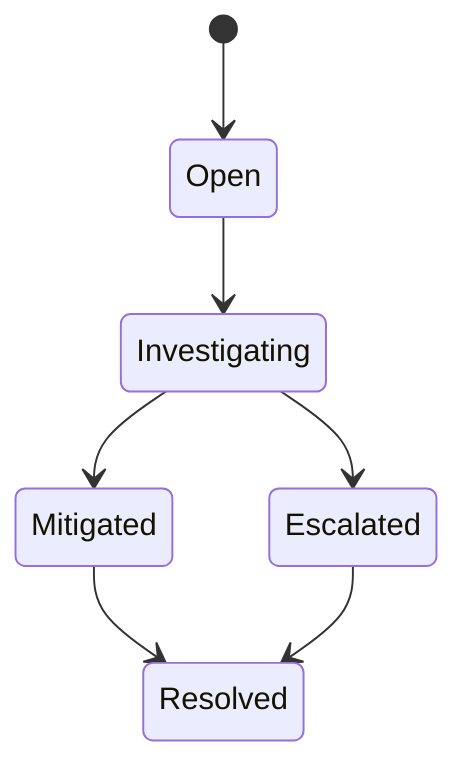

---

# 20. First-Release API Boundaries

These interfaces are derived from the user flows.

## 20.1 Workspace API

```text
POST   /workspaces
GET    /workspaces/:id
PATCH  /workspaces/:id/mode
```

## 20.2 Provider and tool inventory API

```text
POST   /providers/bitget/connect
GET    /providers/:id/tools
POST   /providers/:id/tools/refresh
POST   /providers/:id/tools/:toolId/approve
POST   /providers/:id/tools/:toolId/freeze
POST   /providers/:id/tools/:toolId/block
GET    /providers/:id/manifest-diff
```

## 20.3 Runs API

```text
POST   /runs
GET    /runs
GET    /runs/:runId
GET    /runs/:runId/events
POST   /runs/:runId/finish
```

## 20.4 Decision API

```text
POST   /runs/:runId/decisions
GET    /runs/:runId/decisions/:decisionId
```

## 20.5 Policy API

```text
GET    /policies
POST   /policies/drafts
POST   /policies/drafts/:id/validate
POST   /policies/drafts/:id/test
POST   /policies/drafts/:id/publish
GET    /policies/:policyId/versions
GET    /policies/:policyId/versions/:versionId/diff
```

## 20.6 Approval API

```text
GET    /approvals
GET    /approvals/:approvalId
POST   /approvals/:approvalId/approve-once
POST   /approvals/:approvalId/reject
```

## 20.7 Replay API

```text
POST   /replays/exact
POST   /replays/policy
POST   /replays/agent
POST   /replays/scenario
GET    /replays/:replayId
GET    /replays/:replayId/diff
```

## 20.8 Incident API

```text
GET    /incidents
GET    /incidents/:incidentId
POST   /incidents/:incidentId/acknowledge
POST   /incidents/:incidentId/resolve
```

## 20.9 Audit API

```text
POST   /runs/:runId/evidence-exports
GET    /evidence-exports/:exportId
```

## 20.10 Telegram API

```text
POST   /telegram/bindings
POST   /telegram/bindings/complete
DELETE /telegram/bindings/:bindingId
POST   /telegram/webhooks
```

---

# 21. MCP Gateway Contract

The gateway is the execution entry point.

## 21.1 Required responsibilities

```text
receive tools/list
→ query upstream tools
→ compare manifest fingerprint
→ return allowed tools

receive tools/call
→ validate input
→ classify operation
→ capture trace context
→ evaluate policy
→ require approval or block when needed
→ forward allowed upstream requests
→ capture sanitized response
→ return structured result
```

## 21.2 Tool classification

| Class | Example | Default behavior |
|---|---|---|
| Public read | ticker, depth, candles | Allow and trace |
| Account read | balances, positions | Allow with audit |
| Trade-like | place order, cancel order, leverage change | Policy-dependent |
| Asset movement | transfer, withdraw | Block by default |
| Administrative | API-key changes, broker operations | Block by default |

## 21.3 Trace context

Every gateway call should carry:

```text
workspace_id
agent_id
run_id
provider_id
tool_manifest_hash
policy_version
mode
trace_id
span_id
```

---

# 22. MVP Vertical Slice Derived from the Flows

The first end-to-end slice must prove the product concept without becoming a throwaway demo.

## Required slice

```text
Developer runs CLI onboarding
→ connects Bitget Agent Hub
→ imports tool inventory
→ opens Web Control Plane
→ runs guided BTCUSDT analysis
→ agent submits a simulated buy proposal
→ policy requests approval
→ Telegram sends approval request
→ user approves once
→ simulated execution succeeds
→ later oversized leveraged proposal is blocked
→ operator opens Run Detail
→ operator replays both runs
→ operator views diff
→ operator exports evidence bundle
```

## Required screens

```text
Onboarding
Dashboard
Runs
Run Detail
Policies
Approvals
Replay & Diff
Tool Inventory
Telegram approval message
```

## Required backend capabilities

```text
Bitget provider connection
Tool import and classification
Manifest fingerprint
Append-only run events
Decision envelope validation
Deterministic policy evaluation
One-time approvals
Telegram delivery
Simulated execution adapter
Exact replay
Policy replay
Diff generation
Evidence export
```

---

# 23. Hackathon Narrative Derived from the Product

The product story should remain honest and Bitget-first.

## Primary message

> Bitget Agent Hub makes AI-native trading easier to build. TraceGuard adds the governed runtime developers need to operate those agents with policy checks, approvals, replay, and auditable evidence.

## Three-minute story

```text
1. Connect Bitget Agent Hub and import tools.
2. Read real Bitget market data through the protected gateway.
3. Approve one bounded simulated trade from Telegram.
4. Block one oversized leveraged proposal automatically.
5. Replay both runs and compare the result.
```

## Claims allowed

```text
Built for the Bitget Agent Hub ecosystem
Bitget-first MCP integration
Provider-neutral runtime architecture
Policy-based controls
Replayable decision traces
One-time approvals
Auditable evidence
Simulated execution support
Tool-manifest monitoring
```

## Claims not allowed

```text
Officially endorsed by Bitget
Integrated with GetClaw unless an official integration exists
Securing all Bitget activity
Eliminating trading risk
Guaranteeing regulatory compliance
Supporting live execution unless demonstrated and documented
```

---

# 24. Open Product Questions

## Onboarding

- Should the CLI automatically modify MCP client config files or only generate snippets?
- Should Telegram binding remain optional during onboarding?
- Which Bitget Agent Hub installation variants must be detected?

## Approvals

- Should approval requests be available through web only when Telegram is disconnected?
- How short should approval expiry be?
- Which actions should always require approval even in Guarded Autopilot mode?

## Policies

- Which default templates create the fastest first value moment?
- Should policy drafting through natural language appear in the initial public release?
- How should policy changes preview historical impact?

## Replay

- Which fields are required for an Exact Replay to be considered valid?
- Which market snapshots must be stored locally?
- When is replay mismatch an incident?

## Telegram

- Is Bot-only enough for the first release?
- Which Mini App screens are necessary beyond approvals and recent blocks?
- Should the Bot send daily summaries by default or only after opt-in?

## Bitget integration

- Which tools are stable enough to fingerprint reliably?
- Which trade-like tools should be simulated first?
- How should write-operation capability differences across environments be surfaced?

---

# 25. Final User Experience Summary

```text
TraceGuard should not feel like another trading app.

It should feel like a safety layer that appears only when needed:

- CLI during setup;
- Web when configuring or investigating;
- Telegram when a human decision is urgent;
- MCP Gateway during every protected agent run.

The user keeps the existing agent workflow.
TraceGuard adds control, approvals, replay, and evidence around it.
```
